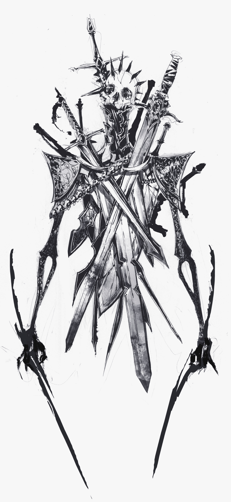

# Nagłówek 1
Paragraf 1  
Paragraf 2  
Paragraf 3  
~~Prosimy nie przekreślać tekstu~~ **bold text** *fancy text*  
>"Wer sich nicht selbst befiehlt, bleibt immer Knecht." ~ Johann Wolfgang von Goathe,Zahme Xenien
 
Top 5 List
1. Lista 1 
2. Lista 2
3. Lista 3
4. Lista 4
5. Lista 5

Listy
- jeden
- dwa
- trzy 
- cztery

`var ilosclini = 3` 
`var numerZajec = 4`  
`let i = 10`  

`for i in range(10):`  
&ensp;&ensp;` if i%2!=0:` 
&emsp;&emsp;`   print("tik")` 
&ensp;&ensp;` if i%2=0:` 
&emsp;&emsp;`   print("tok")` 

